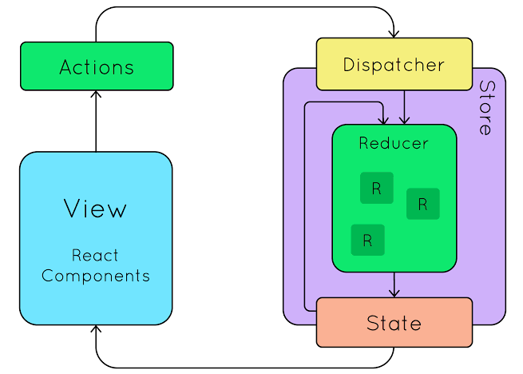

# :pencil2: Arquitetura Flux + Redux :computer:

## Problema:

A arquitetura Flux foi criada para solucionar o problema de distribuir os dados da aplicação para todos os componentes, ou 
então fazer com que os componentes enviem algum dado ou ação para que outro componente responda. Isso sem contar que cada componente pode guardar seus próprios dados. Caso um dado esteja presente em vários componentes diferentes você vai ter um certo trabalho para garantir que ele esteja sempre atualizado em todos os lugares, evitando inconsistências.

## Solução:

A solução para esse problema foca em colocar todos os dados da aplicação em um único lugar, assim todos os componentes possuem um lugar comum que contém as informações/dados e permite a comunicação entre eles.

Dessa maneira só precisamos alterar nossos dados em um único lugar, garantindo que todos os componentes da aplicação sempre estarão com o mesmo dado.

### Arquitetura Flux


* View:

    A View é simplesmente os componentes visuais que são apresentados, ou seja, tudo o que aparece na tela para o usuário. 
    Eles sempre passam dados de pai para filho, fazendo um fluxo de dados unidirecional. Nunca que um filho pode influenciar no pai.

* Actions:

    Método para garantir uma boa comunicação entre a View e as funções da Store. Elas são simplesmente objetos que usamos para padronizar a comunicação entre View e Dispatcher.

* Store:

    A Store é onde ficam os dados e lógica da aplicação. Então a View consome os dados presentes na Store. E é junto à Store que ficam as funções que alteram esses dados. 

* Dispatcher:

    Dispatcher é a "central de comunicação" onde ela repassa para a Store o que precisa ser feito. Se um componente chamar o Dispatcher para uma função que não existe na Store nada vai acontecer.

### Arquitetura Flux + React Js + Redux


Para reproduzir o conceito da Flux Architecture usei React jS para criar a interface de interação e usei Redux para criar o modelo de flux. O projeto tem como foco a criação de uma TO-DO list e sua dinâmica sendo construída a partir dos conceitos da Arquitetura Flux, ou seja, adicionar e remover elementos são funções que estão ligadas ao Flux.

- View no projeto: 

    Basicamente, as Views do projeto são componentes que contêm a lista, o elemento que estrutura o item da lista e o input que adiciona novos elementos.

- Actions no projeto: 

    As actions do projeto estão localizadas no arquivo todos.ts na pasta reducers. As principais actions são de adicionar e remover novos elementos na lista de TO-DO e seu comportamento padrão. 

    ```markdown
        switch(action.type){
            case "ADD": 
                return [ ...state,  {
                    id: action.payload.id,
                    text: action.payload.text
                }]
            break;
            case "REMOVE":
                const tmpState:TodoStateProps[] = [...state];

                let newState: TodoStateProps[];
        
                newState = tmpState.filter( item => item.id !== action.payload.id);
                
                return newState;
            break;
            default:
                return state;
            break;
        }
    ```

    Para adicionar um novo elemento, basicamente, eu retorno os elementos contidos no estado com a adição do novo item da lista ```markdown return [ ...state,  { id: action.payload.id, text: action.payload.text }]```

    A exclusão de um elemento na lista de tarefas se concentra em verificar a matriz e fazer um filtro para remover o elemento que possui o mesmo id do item selecionado. Em seguida, ele retorna a matriz atualizada.

    ```markdown
        const tmpState:TodoStateProps[] = [...state];

        let newState: TodoStateProps[];

        newState = tmpState.filter( item => item.id !== action.payload.id);
        
        return newState;

    ```

- Store no projeto: 

    Ele está resumido no arquivo todo.ts na pasta reducers onde contém os dados e lógica da aplicação.

- Dispatcher no projeto: 

    Os Dispatchers estão contidos nas funções responsáveis ​​por ativar as ações do projeto.
    ```markdown
        function handleAddTodo(){
            dispatch({ type: "ADD", payload: { id: state.length + 1, text: text } });

            setText("");
        }

        function handleRemoveElement(e: number){
            dispatch({ type: "REMOVE", payload:{ id: e }});
        }
    ```



Modelo da arquitetura Flux aplicada ao Redux.

