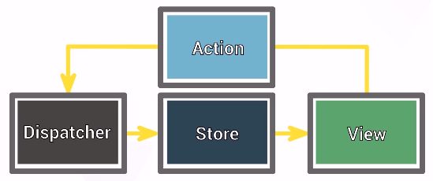

# :pencil2: Arquitetura Flux + Redux :computer:

## Problema:

A arquitetura Flux foi criada para solucionar o problema de distribuir os dados da aplicação para todos os componentes, ou 
então fazer com que os componentes enviem algum dado ou ação para que outro componente responda. Isso sem contar que cada componente pode guardar seus próprios dados. Caso um dado esteja presente em vários componentes diferentes você vai ter um certo trabalho para garantir que ele esteja sempre atualizado em todos os lugares, evitando inconsistências.

## Solução:

A solução para esse problema foca em colocar todos os dados da aplicação em um único lugar, assim todos os componentes possuem um lugar comum que contém as informações/dados e permite a comunicação entre eles.

Dessa maneira só precisamos alterar nossos dados em um único lugar, garantindo que todos os componentes da aplicação sempre estarão com o mesmo dado.

### Arquitetura Flux

* View:

    A View é simplesmente os componentes visuais que são apresentados, ou seja, tudo o que aparece na tela para o usuário. 
    Eles sempre passam dados de pai para filho, fazendo um fluxo de dados unidirecional. Nunca que um filho pode influenciar no pai.

* Actions:

    Método para garantir uma boa comunicação entre a View e as funções da Store. Elas são simplesmente objetos que usamos para padronizar a comunicação entre View e Dispatcher.

* Store:

    A Store é onde ficam os dados e lógica da aplicação. Então a View consome os dados presentes na Store. E é junto à Store que ficam as funções que alteram esses dados. 

* Dispatcher:

    Dispatcher é a "central de comunicação" onde ela repassa para a Store o que precisa ser feito. Se um componente chamar o Dispatcher para uma função que não existe na Store nada vai acontecer.